# Web development — past, present, and possible futures

## Presentation

```json
{
  "version": 1,
  "title": "Web development — past, present, and possible futures",
  "start": "step-1",
  "theme": {
    "background": "#ffffff",
    "text": "#202020",
    "muted": "#616161",
    "accent": "#e6e6e6",
    "headingFont": "Georgia, serif",
    "bodyFont": "Arial, sans-serif",
    "codeFont": "Menlo, monospace"
  }
}
```

## Slide: Web development: past, present, and possible futures

```json
{
  "id": "step-1",
  "type": "title",
  "chapter": "Opening",
  "next": "contents",
  "related": []
}
```

How do we organize, connect, and use knowledge?

Explore the web’s history and possible futures while we build an application together.

Juho Vepsäläinen · 16.9.26

<!-- speaker-notes -->

Two threads: how the web addresses an old knowledge problem, and how we develop for it with agents today. Participation shapes the application. Early visions are a lens for comparison, not a single inevitable lineage.
Teaching aims for presenter reference: trace a browser submission; distinguish server state from browser knowledge; evaluate a generated view against its sources, permitted actions and fallback.

## Slide: Today’s route

```json
{
  "id": "contents",
  "type": "material",
  "chapter": "Opening",
  "next": "join-live"
}
```

1. **Past** — Finding knowledge; documents, links and native forms
2. **Present** — Browser interaction; AJAX and shared state
3. **Future** — What people might delegate to agents
4. **References** — Sources and further reading

<!-- speaker-notes -->

Introduce the route. After the practice activities, introduce the seminar app, collect its audience inputs and start the first build. Then discuss Past while it runs.

## Slide: Join the live lecture

```json
{
  "id": "join-live",
  "type": "material",
  "chapter": "Opening",
  "next": "practice-poll"
}
```


[**live.scalableweb.dev**](https://live.scalableweb.dev/)

Keep this page open for votes and word clouds. No account needed.

<!-- speaker-notes -->

Explain the phone/browser setup here. The QR opens the direct audience URL with no redirect. Check the active-browser count beside Live. Students can also type the printed URL. Use the next two practice activities to check that everyone can participate.

## Slide: Practice vote: which drink would you pick?

```json
{
  "id": "practice-poll",
  "type": "poll",
  "chapter": "Opening",
  "next": "practice-cloud",
  "poll": {
    "question": "Practice vote: which drink would you pick?",
    "options": [
      {
        "id": "coffee",
        "label": "Coffee"
      },
      {
        "id": "tea",
        "label": "Tea"
      },
      {
        "id": "water",
        "label": "Water"
      }
    ],
    "defaultId": "water"
  },
  "room": "webdev-2026-practice"
}
```

<!-- speaker-notes -->

Practice only; this result does not affect any build. Showing the slide opens voting. Ask students to choose and submit, then try changing their choice. Close voting to show the result.

## Slide: Practice word cloud: name a place you would like to visit

```json
{
  "id": "practice-cloud",
  "type": "question",
  "chapter": "Opening",
  "next": "demo-background",
  "wordCloud": true
}
```

Enter **one place per line** on live.scalableweb.dev.

Use 1–3 words per idea, up to 32 characters. Submit up to five ideas together.

<!-- speaker-notes -->

Practice only; these words are never used in build prompts. Showing this slide opens its collection. Close collection, review privately, approve a few entries, and show the approved cloud. Demonstrate that multiple ideas use separate lines. Return to the slide before continuing.

## Slide: One seminar app, three stages

```json
{
  "id": "demo-background",
  "type": "material",
  "chapter": "Opening",
  "next": "knowledge-experience"
}
```

We’ll build an app to help someone decide whether to attend **SDLCAI, a seminar about AI in software development**.

1. **Document:** find the seminar essentials and follow source links.
2. **Interactive app:** submit preferences and see shared results.
3. **Generated view:** adapt the information to a chosen priority.

<!-- speaker-notes -->

Introduce the seminar scenario before collecting the first build’s inputs. We start with an information page, then add a native form, browser interaction and a generated view. Audience information needs shape the first page’s headings and ordering; the theme vote shapes its presentation. No HTML knowledge is needed for these choices. Distinguish the coding agent implementing the app from the model used inside it later.

## Slide: When deciding whether to attend a seminar, what information do you need first?

```json
{
  "id": "knowledge-experience",
  "type": "question",
  "chapter": "Opening",
  "next": "vote-theme",
  "wordCloud": true
}
```

**Word cloud**

On live.scalableweb.dev, enter **one idea per line**.

Use 1–3 words per idea, up to 32 characters. Submit up to five ideas together.

<!-- speaker-notes -->

Showing this slide while Live is on automatically opens its word collection. Close collection, review submissions privately, approve relevant responses, then Show approved cloud. Discuss two or three needs drawn from the students’ own contributions; do not seed the collection with examples. Connect these needs to the first document’s headings and ordering; refer back to them when checking the build. Frequency is a discussion cue, not proof of importance. Use Back to slide before continuing. If collection is unavailable, take three spoken responses. Never project unreviewed submissions.

## Slide: Which visual theme should shape our app?

```json
{
  "id": "vote-theme",
  "type": "poll",
  "chapter": "Opening",
  "next": "build-document",
  "poll": {
    "question": "Which visual theme should shape our app?",
    "options": [
      {
        "id": "editorial",
        "label": "Editorial"
      },
      {
        "id": "retro-web",
        "label": "Retro web"
      },
      {
        "id": "playful",
        "label": "Playful"
      }
    ],
    "defaultId": "editorial"
  },
  "room": "webdev-2026"
}
```

<!-- speaker-notes -->

This slide opens its prepared poll automatically; closing or leaving freezes the result. Missing decisions require explicitly accepted defaults.

## Slide: Build · Create the seminar document

```json
{
  "id": "build-document",
  "type": "build",
  "chapter": "Opening",
  "next": "step-4",
  "related": [],
  "uses": [
    {
      "poll": "vote-theme",
      "instructions": {
        "editorial": "Use an editorial theme with restrained typography.",
        "retro-web": "Use a readable retro-web theme with accessible contrast.",
        "playful": "Use a playful theme with readable typography and accessible controls."
      }
    }
  ],
  "wordsFrom": "knowledge-experience"
}
```

Build a readable SDLCAI information page from the reviewed seminar sources. Use the approved audience needs for headings and ordering, and apply the chosen theme. Include real source links. Show a local preview and check the result. Stop before adding the form.

<!-- speaker-notes -->

Review the approved audience needs and frozen theme, then explicitly start the first build here, before entering Past. The coding agent works in the separate app project while you discuss the historical visions, CERN, HTML, CSS, JavaScript and early editors. Keep the document checkpoint after Dreamweaver so the build has the entire historical discussion to finish. If it is still running, use the clearly labeled prepared reference without treating it as the build’s result.

## Slide: Past

```json
{
  "id": "step-4",
  "type": "title",
  "source": "Historical framing · [1, 2, 3, 4, 5]",
  "chapter": "Past",
  "next": "vision-otlet",
  "related": []
}
```

Finding and connecting knowledge

<!-- speaker-notes -->

Start with distinct ambitions for organizing and using knowledge. These are conceptual precursors, not a claim of a direct chain of influence. Then introduce CERN’s concrete information problem and Berners-Lee’s response.

## Slide: Otlet: organizing knowledge (1895)

```json
{
  "id": "vision-otlet",
  "type": "material",
  "source": "[1, 6] Mundaneum · Photo: fdecomite, 2011 · CC BY 2.0",
  "chapter": "Past",
  "next": "vision-bush",
  "related": [],
  "allowRemoteImages": true
}
```


The Universal Bibliographic Repertory: a shared catalogue of publications, organized for retrieval.

<!-- speaker-notes -->

One ambition, not a biography: make knowledge discoverable beyond a local collection. Mention classification and the broader ideal of international cooperation. A conceptual precursor, not a claim of direct influence on Berners-Lee.
Source keys resolve to the References slides at the end. Unquoted explanations are lecture paraphrases; diagrams are not archival reproductions.
Title year refers to the creation of the Universal Bibliographic Repertory (1895). Date source: Mundaneum, https://mundaneum.org/nl/collections/het-universele-bibliografische-repertorium/ .
Photo shows the catalogue drawers at the Mundaneum in Mons in 2011, not the institution in 1895. Point to the physical drawers to explain the scale and work of indexing. Photo: fdecomite, Drawers, 23 February 2011, via Wikimedia Commons; CC BY 2.0. Unmodified. If the archival image is unavailable, use the visible explanatory caption. The unmodified CC BY 2.0 photograph is packaged locally; credit and license are in public/lecture-assets/README.md.

## Slide: Bush: Memex and associative trails (1945)

```json
{
  "id": "vision-bush",
  "type": "material",
  "source": "[2, 7] Memex sketch, c. 1945 · Computer History Museum",
  "chapter": "Past",
  "next": "bush-trail",
  "related": ["bush-trail"],
  "allowRemoteImages": true
}
```


Memex was a proposal: preserve an associative trail between records, rather than only filing each record in a category.

[As We May Think (1945)](https://www.w3.org/History/1945/vbush/vbush-all.shtml)

<!-- speaker-notes -->

Contrast associative trails with placing each item in a category. The memex was a proposed personal device, not an implemented web. Relate to following references during an assignment.
Source keys resolve to the References slides at the end. Unquoted explanations are lecture paraphrases; diagrams are not archival reproductions. This is a proposed device, never built. Point to the two displays: how would you preserve the path between two records?
Full attribution: [2, 7] Memex conceptual sketch · c. 1945 · Computer History Museum, object 500004817

## Slide: A research trail is more than a folder

```json
{
  "id": "bush-trail",
  "type": "material",
  "source": "[2] Bush, 1945 · Teaching diagram",
  "chapter": "Past",
  "next": "vision-nelson"
}
```

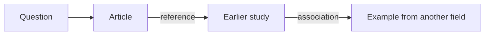

[Bush: As We May Think (1945)](https://www.w3.org/History/1945/vbush/vbush-all.shtml)

<!-- speaker-notes -->

This is a modern explanatory example, not Bush’s original illustration. Ask whether bookmarks retain the reason each source mattered.
Source keys resolve to the References slides at the end. Unquoted explanations are lecture paraphrases; diagrams are not archival reproductions.
Full attribution: Original explanatory diagram · [2] Vannevar Bush (1945)

## Slide: Nelson: hypertext and Xanadu (1965)

```json
{
  "id": "vision-nelson",
  "type": "material",
  "source": "[3, 8] Nelson, 1965 · Diagram reproduced 2000",
  "chapter": "Past",
  "next": "vision-engelbart",
  "related": [],
  "allowRemoteImages": true
}
```


Hypertext supports non-sequential reading; Xanadu also pursued visible connections and reuse tied to origins.

[A File Structure for the Complex, the Changing and the Indeterminate (1965)](https://doi.org/10.1145/800197.806036)

<!-- speaker-notes -->

OPTIONAL IF SHORT ON TIME: skip this discussion; keep the next build checkpoint and review. Hypertext term introduced in 1965. Distinguish basic non-sequential reading from Xanadu’s richer ambition: visible connections and reuse tied to origins. Do not imply the web implemented all of Xanadu. Existing vault clippings on Xanadu offer contrasting contemporary opinions, not historical proof.
Source keys resolve to the References slides at the end. Unquoted explanations are lecture paraphrases; diagrams are not archival reproductions. Distinguish links between items from shared content (transclusion). This is a conceptual diagram, not a screenshot of a working 1965 system.
Full attribution: [8] Ted Nelson · 1965 connection diagram reproduced in his 2000 survey, Fig. 1

## Slide: Engelbart: the NLS demonstration (1968)

```json
{
  "id": "vision-engelbart",
  "type": "material",
  "source": "[4, 9] NLS, 1968 · Doug Engelbart Institute",
  "chapter": "Past",
  "next": "cern-connections",
  "related": [],
  "allowRemoteImages": true
}
```


The demonstration combined linked information and shared work: augment people’s ability to solve problems together.

[Augmenting Human Intellect: A Conceptual Framework (1962)](https://dougengelbart.org/content/view/138/)

<!-- speaker-notes -->

Emphasize augmentation rather than replacement. His later NLS work gives a concrete bridge to collaborative applications. Ask students to keep this ambition in mind as an agent helps us build. Avoid turning this into a mouse-invention anecdote.
Source keys resolve to the References slides at the end. Unquoted explanations are lecture paraphrases; diagrams are not archival reproductions. The photo shows the 1968 demonstration, six years after his 1962 conceptual framework. Point to the shared display: people can work with information together. Source: https://dougengelbart.org/content/view/224/217/ , section 4b. If the archival image is unavailable, use the visible explanatory caption.
Full attribution: [4, 9] NLS demonstration · 9 December 1968 · Doug Engelbart Institute archive

## Slide: CERN: one filing tree is not enough (1989)

```json
{
  "id": "cern-connections",
  "type": "material",
  "source": "[5] © Tim Berners-Lee, 1989/1990 · W3C archive",
  "chapter": "Past",
  "next": "cern-problem",
  "allowRemoteImages": true
}
```

Projects change, people leave, and information is spread across incompatible systems.

A person can belong to several projects; a document can describe several systems. Where should each record go?

<!-- speaker-notes -->

Establish the working context before introducing Tim Berners-Lee. Explain one person belonging to two projects. This paraphrases the problem described in the 1989 proposal; do not read the archival diagram here.

## Slide: CERN: finding shared knowledge (1989)

```json
{
  "id": "cern-problem",
  "type": "material",
  "source": "[5, 10, 11] Berners-Lee · Photo: CERN, 1994",
  "chapter": "Past",
  "next": "worldwideweb-browser",
  "related": ["cern-connections"],
  "allowRemoteImages": true
}
```


> Often, the information has been recorded, it just cannot be found.

Tim Berners-Lee · Information Management: A Proposal

His proposal: follow links between documents, including documents on different servers.

<!-- speaker-notes -->

Explain changing projects, people leaving and information spread across incompatible systems. This is the problem behind the proposal, not a desire to invent another interface. The source is dated March 1989 and May 1990.
Source keys resolve to the References slides at the end. Unquoted explanations are lecture paraphrases; diagrams are not archival reproductions. Photo dates from 1994, not the 1989 proposal. Photo source: https://home.cern/science/computing/the-birth-of-the-web/ ; CERN record 39437. If the archival image is unavailable, use the visible explanatory caption.
Full attribution: [5, 11] Tim Berners-Lee · Proposal 1989/1990 · Photo: CERN, 1994
The 1990 proposal explains that linked nodes need not be on the same machine. Trace that distinction verbally: many relationships, with documents maintained by different groups. The earlier thinkers posed distinct ambitions; the web did not implement all of them.

## Slide: WorldWideWeb browser-editor (1990)

```json
{
  "id": "worldwideweb-browser",
  "type": "material",
  "source": "[12] Berners-Lee / W3C · Screenshot, 1993",
  "chapter": "Past",
  "next": "step-5",
  "related": [],
  "allowRemoteImages": true
}
```


The browser also edited documents and created links: authoring and reading belonged in the same tool.

<!-- speaker-notes -->

Use the screenshot instead of explaining the interface in bullets. Point out the Link menu and editing. Ask: what changes when you can create links as well as follow them? This is the 1993 screenshot, not an image of the original 1990 release. If the archival image is unavailable, use the visible explanatory caption.
Full attribution: [12] Tim Berners-Lee / W3C · WorldWideWeb (written 1990); screenshot 1993

## Slide: HTML: headings, paragraphs and links

```json
{
  "id": "step-5",
  "type": "material",
  "source": "[13, 14] HTML semantics · Teaching example",
  "chapter": "Past",
  "next": "css-foundations",
  "related": []
}
```

```html
<h1>Seminar</h1>
<p>Topic, date and location.</p>
<a href="https://www.sdlcai.org/">Seminar details</a>
```

### Seminar

Topic, date and location.

[Seminar details](https://www.sdlcai.org/)

<!-- speaker-notes -->

Identify the heading, paragraph and link. Relate this modern HTML teaching example to the seminar page already being built from the audience’s needs. The link opens the real SDLCAI site. Next distinguish styling and browser behavior; inspect the generated document after the early editors.

## Slide: CSS: presentation rules (1996)

```json
{
  "id": "css-foundations",
  "type": "material",
  "source": "[15] W3C · CSS1 Recommendation, 17 December 1996",
  "chapter": "Past",
  "next": "javascript-foundations",
  "related": []
}
```

Style the same HTML without changing its meaning.

```css
h1 {
  color: navy;
  font-size: 2em;
}
```

The selector chooses headings; the declarations change how they look.

<!-- speaker-notes -->

Håkon Wium Lie proposed CSS in 1994; the title marks the first W3C Recommendation, co-authored with Bert Bos, in 1996. Point back to the HTML h1: it remains a heading when its color or size changes. The cascade combines rules from different sources. Keep this at the level of structure versus presentation; the onion model returns to it later. This is an original teaching example.

## Slide: JavaScript: behavior in the browser (1995)

```json
{
  "id": "javascript-foundations",
  "type": "material",
  "source": "[16] Wirfs-Brock & Eich · JavaScript: The First 20 Years",
  "chapter": "Past",
  "next": "geocities-personal-page",
  "related": []
}
```

Respond to an action and update the current page.

```javascript
const button = document.querySelector("button");
button.addEventListener("click", () => {
  document.querySelector("h1").textContent = "Welcome!";
});
```

Changing the page does not by itself save anything on the server.

<!-- speaker-notes -->

Brendan Eich created JavaScript at Netscape in 1995. This uses modern syntax and DOM APIs; it is not 1995 source code. Assume the page has a button and heading. Explain the event, handler and visible change. The DOM is a browser API used from JavaScript. We cover HTML, CSS and JS by role, not strict release order; CSS1’s Recommendation followed JavaScript’s introduction. Connect these roles to the seminar app already being built, then turn to early web publishing and authoring tools.

## Slide: GeoCities: personal publishing (1994)

```json
{
  "id": "geocities-personal-page",
  "type": "material",
  "source": "[17] GeoCities archive · Lialina & Espenschied · Capture 2009",
  "chapter": "Past",
  "next": "editor-frontpage",
  "allowRemoteImages": true
}
```


Personal publishing widened who could make a web page, while the hosting platform still controlled its availability.

<!-- speaker-notes -->

Use briefly after the browser-editor: personal publishing rather than just institutional information. Ask what students would put on a page of their own. Distinguish control of a page’s design from ownership of its hosting platform. Archive capture date is not the page’s creation date. Screenshot produced by Olia Lialina and Dragan Espenschied’s archive project from rescued files; not necessarily a screenshot taken in 2009.
Full attribution: [17] GeoCities CollegePark/Lounge/9002 · archived 28 April 2009 · One Terabyte of Kilobyte Age
Title year refers to GeoCities’ founding, not the archived page or screenshot. Date source: David Bohnett Foundation biography, https://www.bohnettfoundation.org/david-bohnett-bio/ .

## Slide: Microsoft FrontPage 1.1 (1996)

```json
{
  "id": "editor-frontpage",
  "type": "material",
  "source": "[18, 19] Microsoft FrontPage 1.1 · Screenshot: Web Design Museum",
  "chapter": "Past",
  "next": "editor-dreamweaver",
  "allowRemoteImages": true
}
```


Edit the page visually; inspect the HTML it produces.

<!-- speaker-notes -->

Spend about one minute here. Connect GeoCities’ personal publishing to desktop authoring tools: a visual editor could help people create the files they published. The date refers to Microsoft FrontPage 1.1, not the original Vermeer product. Microsoft acquired Vermeer in January 1996. Avoid presenting vendor claims about ease of use as measured accessibility or browser compatibility. Ask: what does the editor handle, and what must the author still understand?
Source: Microsoft announcement, 6 August 1996: https://news.microsoft.com/source/1996/08/06/microsoft-frontpage-1-1-momentum-explodes-in-first-two-months-industry-lauds-web-authoring-and-management-tool-as-best-of-breed/
Screenshot shows FrontPage 1.1 (1996), with the visual editor behind the View HTML dialog. Point out the relationship between the formatted page and its source. Screenshot preserved by Web Design Museum; software interface © Microsoft. This is a later capture of historical software, not a photograph dated 1996. If the archival image is unavailable, use the visible explanatory caption.

## Slide: Macromedia Dreamweaver (1997)

```json
{
  "id": "editor-dreamweaver",
  "type": "material",
  "source": "[20, 21] Macromedia · Screenshot: Web Design Museum, Dreamweaver 1.2",
  "chapter": "Past",
  "next": "check-document",
  "allowRemoteImages": true
}
```


Visual page editing · Dreamweaver 1.2 (1998)

<!-- speaker-notes -->

Spend about one minute here. This is the Macromedia editor later associated with Adobe. The December 1997 launch emphasized visual authoring and preserving existing HTML when working with an external source editor; do not imply that later split-view UI already existed in the first release. Compare with FrontPage without treating them as identical products or making unsupported claims about their output quality. Recall the HTML example: authoring tools change, but the generated document still matters. Inspect our generated document next.
Source: Macromedia launch announcement dated 8 December 1997, reproduced by MacTech on 9 December: https://www.mactech.com/1997/12/09/md1-macromedia-ships-dreamweaver/
The title dates Dreamweaver’s first release in 1997. The screenshot shows version 1.2 for Windows (1998), labeled separately in the caption. Point out the visual document and formatting controls. Screenshot preserved by Web Design Museum; software interface © Macromedia. If the archival image is unavailable, use the visible explanatory caption.

## Slide: Check the build · The document

```json
{
  "id": "check-document",
  "type": "material",
  "chapter": "Past",
  "next": "check-document-review",
  "previewOf": "build-document"
}
```

- Find the seminar essentials and follow a real link.
- Check the headings and reading order.
- Compare the result with the audience’s chosen theme.

<!-- speaker-notes -->

The linked build preview appears automatically on this slide. Advance to return to the lecture. If no preview URL is available, a clearly labeled prepared reference opens. Its behavior is not evidence that the live build succeeded.

Checks to narrate:

- Find the seminar essentials and follow a real link.
- Check the headings and reading order.
- Compare the result with the audience’s chosen theme.

## Slide: Did the document answer your questions?

```json
{
  "id": "check-document-review",
  "type": "question",
  "chapter": "Past",
  "next": "seminar-form-fields",
  "reviewWordsFrom": ["knowledge-experience"]
}
```

Find the information you asked for in the app we just inspected.

Which need is met? What is still missing or hard to find?

<!-- speaker-notes -->

Revisit the approved responses after showing the app. Ask the room to distinguish observed behavior from assumptions. Keep one unresolved need for the closing discussion.

## Slide: What would you like from the seminar?

```json
{
  "id": "seminar-form-fields",
  "type": "material",
  "chapter": "Past",
  "next": "step-7"
}
```

- **Experience:** new to the subject, some experience, or regular use
- **Interests:** choose one or more topics—learning, practical use, or evaluation
- **Session format:** talk, live demo, or discussion
- **Question for the speaker:** optional, up to 200 characters

Next we will build this survey. After the build, we’ll submit fresh responses and compare the room’s preferences.

<!-- speaker-notes -->

Introduce this as a seminar-interest survey, not a registration or booking. These are new answers collected in the app; earlier lecture votes only shape its design. Explain that the shared display shows counts for the predefined choices. Free-text questions stay out of the shared display and model inputs. Use the variety of controls to demonstrate labels, repeated field names, required choices, server validation and preserving a partially completed form.

## Slide: HTML forms

```json
{
  "id": "step-7",
  "type": "material",
  "source": "[22] WHATWG HTML forms · Teaching example",
  "chapter": "Past",
  "next": "build-forms",
  "related": ["step-8"]
}
```

```html
<form action="/responses" method="post">
  <label for="experience">Experience</label>
  <select id="experience" name="experience" required>
    <option value="">Choose one</option>
    <option value="new">New to the subject</option>
    <option value="some">Some experience</option>
    <option value="regular">Regular use</option>
  </select>
  <button>Send response</button>
</form>
```

One field from the seminar-interest form.

<!-- speaker-notes -->

This excerpt shows one field; the build adds all four inputs. Selecting Some experience sends experience=some. Multiple interest checkboxes use the same name, topic, so the server must read all submitted values. Explain browser validation, then demonstrate that the server validates the same constraints. The /responses route is part of the demo app, separate from lecture voting rooms.
[22] WHATWG HTML forms · Teaching example.

## Slide: Build · Add the seminar-interest form

```json
{
  "id": "build-forms",
  "type": "build",
  "chapter": "Past",
  "next": "flow-native",
  "related": ["step-8"],
  "uses": [
    {
      "poll": "vote-theme",
      "instructions": {
        "editorial": "Use an editorial theme with restrained typography.",
        "retro-web": "Use a readable retro-web theme with accessible contrast.",
        "playful": "Use a playful theme with readable typography and accessible controls."
      }
    }
  ]
}
```

Build Document B: a native seminar-interest form with fresh audience submissions. Collect experience (required select: new, some, regular), topic (checkboxes: learning, practical, evaluation; at least one), format (required radio: talk, demo, discussion), and question (optional textarea, maximum 200 characters). Use visible labels, fieldsets and legends. Implement POST /responses with server-side allowlist and length validation; preserve entered values and show field errors on invalid submission. Save a structured response, then return a 303 redirect to GET /results. That page confirms this browser’s predefined submitted values and shows aggregate counts. Exclude the free-text question from shared pages. Use a demo-browser identifier so resubmission replaces that browser’s response. Show aggregate counts only for predefined fields. Store questions for presenter review, never in the public aggregate or model context. Extend the demo app’s data model; the prepared lecture poll backend only accepts a single choice and is not this form’s storage. Verify submission, invalid input and replacement without JavaScript. Do not deploy until requested. Stop before browser enhancement.

<!-- speaker-notes -->

Start explicitly; the next automatic app checkpoint is Check the native form. Trace POST /responses → validation → Database → 303 redirect → GET /results while the build runs.

## Slide: Native form submission · 1/4 Submit

```json
{
  "id": "flow-native",
  "type": "material",
  "source": "[22, 23] Teaching model · Adapted from Vepsäläinen",
  "chapter": "Past",
  "next": "flow-native-2",
  "related": ["flow-json-4"]
}
```

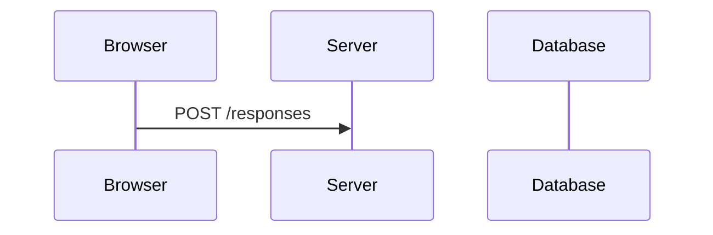

<!-- speaker-notes -->

Model, not a network recording. This example uses POST/Redirect/GET; returning HTML directly is another valid native-form response. Point to experience=some, then follow the same value through the server. Ask who rendered the results. Browser restoration of local fields can vary; do not claim every reload always clears every input. Compare with the actual generated form.
Reveal 1 of 4: Submit. Advance with Next; Previous revisits the preceding state.
Full attribution: Explanatory model · [22, 23] Adapted for this lecture from Juho Vepsäläinen’s Web architecture lens

## Slide: Native form submission · 2/4 Store

```json
{
  "id": "flow-native-2",
  "type": "material",
  "source": "[22, 23] Teaching model · Adapted from Vepsäläinen",
  "chapter": "Past",
  "next": "flow-native-3",
  "related": ["flow-json-4"]
}
```

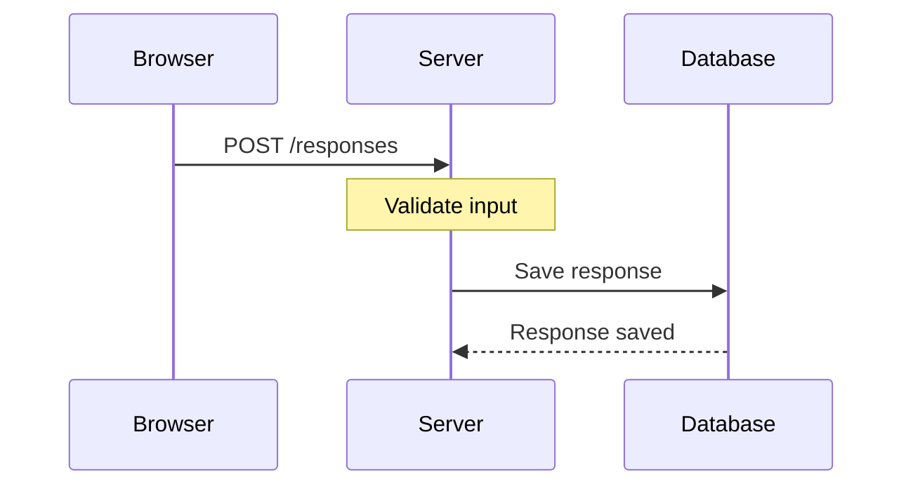

<!-- speaker-notes -->

Model, not a network recording. This example uses POST/Redirect/GET; returning HTML directly is another valid native-form response. Point to experience=some, then follow the same value through the server. Ask who rendered the results. Browser restoration of local fields can vary; do not claim every reload always clears every input. Compare with the actual generated form.
Reveal 2 of 4: Store. Advance with Next; Previous revisits the preceding state.
Full attribution: Explanatory model · [22, 23] Adapted for this lecture from Juho Vepsäläinen’s Web architecture lens

## Slide: Native form submission · 3/4 Redirect

```json
{
  "id": "flow-native-3",
  "type": "material",
  "source": "[22, 23] Teaching model · Adapted from Vepsäläinen",
  "chapter": "Past",
  "next": "flow-native-4",
  "related": ["flow-json-4"]
}
```

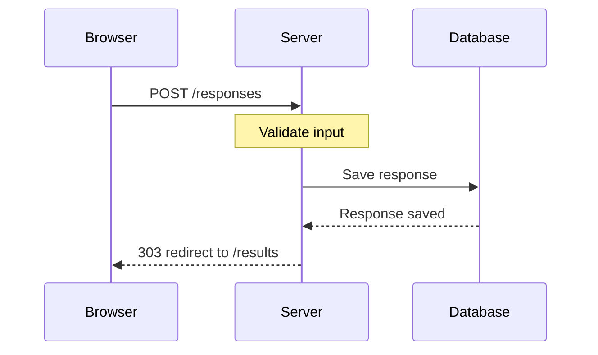

<!-- speaker-notes -->

Model, not a network recording. This example uses POST/Redirect/GET; returning HTML directly is another valid native-form response. Point to experience=some, then follow the same value through the server. Ask who rendered the results. Browser restoration of local fields can vary; do not claim every reload always clears every input. Compare with the actual generated form.
Reveal 3 of 4: Redirect. Advance with Next; Previous revisits the preceding state.
Full attribution: Explanatory model · [22, 23] Adapted for this lecture from Juho Vepsäläinen’s Web architecture lens

## Slide: Native form submission · 4/4 Load results

```json
{
  "id": "flow-native-4",
  "type": "material",
  "source": "[22, 23] Teaching model · Adapted from Vepsäläinen",
  "chapter": "Past",
  "next": "step-8",
  "related": ["flow-json-4"]
}
```

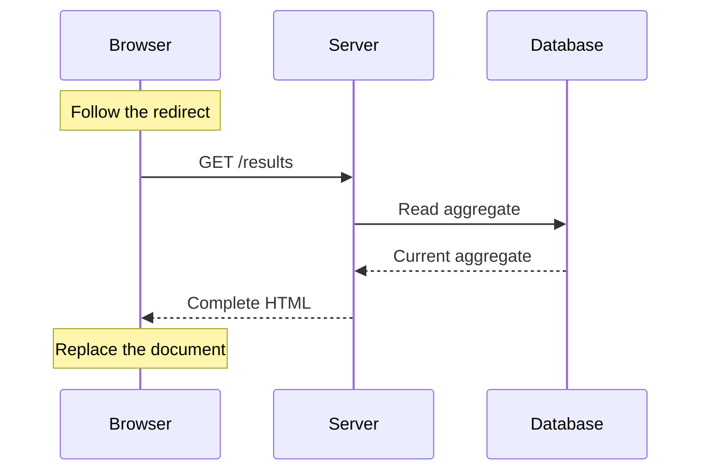

<!-- speaker-notes -->

Model, not a network recording. This example uses POST/Redirect/GET; returning HTML directly is another valid native-form response. Point to experience=some, then follow the same value through the server. Ask who rendered the results. Browser restoration of local fields can vary; do not claim every reload always clears every input. Compare with the actual generated form.
Reveal 4 of 4: Load results. Advance with Next; Previous revisits the preceding state. This slide focuses on the GET after the redirect; submission and storage were shown in the preceding slides.
Full attribution: Explanatory model · [22, 23] Adapted for this lecture from Juho Vepsäläinen’s Web architecture lens

## Slide: Progressive enhancement (2003)

```json
{
  "id": "step-8",
  "type": "material",
  "source": "[24] Champeon & Finck, 2003 · Onion diagram: teaching adaptation",
  "chapter": "Past",
  "next": "enhancement-css",
  "related": []
}
```

```onion 1
HTML | Read the content and submit the form
CSS | Make the same content easier to scan
JavaScript | Update results without navigating
```

HTML provides the core task: read and submit.

[Original presentation: Champeon & Finck, SXSW 2003](https://web.archive.org/web/20210226200650/http://www.hesketh.com/publications/inclusive_web_design_for_the_future/)

<!-- speaker-notes -->

Explain from the centre outward. HTML provides content and the native form; the server processes the submission. CSS enhances presentation. JavaScript enhances interaction. Remove either enhancement and the core task should remain available. This onion is an original teaching illustration, not a reproduction of the original presentation. The principle does not guarantee accessibility: still test labels, keyboard use, focus and feedback.
Original source: Steven Champeon and Nick Finck, Inclusive Web Design for the Future, SXSW 2003. Original URL: http://www.hesketh.com/publications/inclusive_web_design_for_the_future/ . Archived link supplied because the original site is unavailable; archive retrieval could not be verified here. Attribution corroborated by Aaron Gustafson’s 2008 A List Apart article [42], which uses a Peanut M&M metaphor for nested HTML, CSS and JavaScript layers.

## Slide: Progressive enhancement (2003)

```json
{
  "id": "enhancement-css",
  "type": "material",
  "source": "[24] Champeon & Finck, 2003 · Onion diagram: teaching adaptation",
  "chapter": "Past",
  "next": "enhancement-js",
  "related": []
}
```

```onion 2
HTML | Read the content and submit the form
CSS | Make the same content easier to scan
JavaScript | Update results without navigating
```

CSS improves presentation; the same HTML still works.

[Original presentation: Champeon & Finck, SXSW 2003](https://web.archive.org/web/20210226200650/http://www.hesketh.com/publications/inclusive_web_design_for_the_future/)

<!-- speaker-notes -->

Explain from the centre outward. HTML provides content and the native form; the server processes the submission. CSS enhances presentation. JavaScript enhances interaction. Remove either enhancement and the core task should remain available. This onion is an original teaching illustration, not a reproduction of the original presentation. The principle does not guarantee accessibility: still test labels, keyboard use, focus and feedback.
Original source: Steven Champeon and Nick Finck, Inclusive Web Design for the Future, SXSW 2003. Original URL: http://www.hesketh.com/publications/inclusive_web_design_for_the_future/ . Archived link supplied because the original site is unavailable; archive retrieval could not be verified here. Attribution corroborated by Aaron Gustafson’s 2008 A List Apart article [42], which uses a Peanut M&M metaphor for nested HTML, CSS and JavaScript layers.

## Slide: Progressive enhancement (2003)

```json
{
  "id": "enhancement-js",
  "type": "material",
  "source": "[24] Champeon & Finck, 2003 · Onion diagram: teaching adaptation",
  "chapter": "Past",
  "next": "check-native-form",
  "related": []
}
```

```onion 3
HTML | Read the content and submit the form
CSS | Make the same content easier to scan
JavaScript | Update results without navigating
```

JavaScript improves interaction; the core task remains available.

[Original presentation: Champeon & Finck, SXSW 2003](https://web.archive.org/web/20210226200650/http://www.hesketh.com/publications/inclusive_web_design_for_the_future/)

<!-- speaker-notes -->

Explain from the centre outward. HTML provides content and the native form; the server processes the submission. CSS enhances presentation. JavaScript enhances interaction. Remove either enhancement and the core task should remain available. This onion is an original teaching illustration, not a reproduction of the original presentation. The principle does not guarantee accessibility: still test labels, keyboard use, focus and feedback.
Original source: Steven Champeon and Nick Finck, Inclusive Web Design for the Future, SXSW 2003. Original URL: http://www.hesketh.com/publications/inclusive_web_design_for_the_future/ . Archived link supplied because the original site is unavailable; archive retrieval could not be verified here. Attribution corroborated by Aaron Gustafson’s 2008 A List Apart article [42], which uses a Peanut M&M metaphor for nested HTML, CSS and JavaScript layers.

## Slide: Submit the survey; inspect confirmation and counts

```json
{
  "id": "check-native-form",
  "type": "material",
  "chapter": "Past",
  "next": "step-6",
  "previewOf": "build-forms"
}
```

- Submit experience, interests and format without JavaScript.
- Leave a required field empty; inspect the error and retained values.
- Change an answer and resubmit; check the confirmation and counts.

<!-- speaker-notes -->

Now submit a fresh response in the visible app. Check invalid input, preserved values and replacement. Inspect the POST /responses and GET /results requests. Verify the displayed aggregate excludes the optional question.

## Slide: Demo · Remove the outer layers

```json
{
  "id": "step-6",
  "type": "material",
  "chapter": "Past",
  "next": "step-10",
  "related": [],
  "layersDemo": true
}
```

Compare Full, No JavaScript, and HTML only in this prepared app.

<!-- speaker-notes -->

Use the embedded app’s layer links. Start with Full and submit; switch to No JavaScript and submit again; switch to HTML only and repeat. Compare confirmation and shared results. Only this prepared app blocks scripts or styles; the studio keeps working. This experiment illustrates the pattern and is not evidence that the generated build implements it. No browser settings changes are needed.

## Slide: Present

```json
{
  "id": "step-10",
  "type": "title",
  "source": "Paraphrase · [25] Jesse James Garrett (2005)",
  "chapter": "Present",
  "next": "vote-interaction",
  "related": ["rendering-location", "flow-json-4", "detour-2-1"]
}
```

Web pages become application-like experiences.

<!-- speaker-notes -->

Gather audience opinions before revealing the build prompt: collect suggestions, discuss the approved cloud, then freeze a priority vote. Only then advance to the resolved prompt and start the Present build.

## Slide: Which interaction improvement should we prioritize?

```json
{
  "id": "vote-interaction",
  "type": "poll",
  "chapter": "Present",
  "next": "build-application",
  "poll": {
    "question": "Which interaction improvement should we prioritize?",
    "options": [
      {
        "id": "confirmation",
        "label": "Clear submission feedback"
      },
      {
        "id": "preserve",
        "label": "Keep my unsent choice"
      },
      {
        "id": "updates",
        "label": "Keep shared results up to date"
      }
    ],
    "defaultId": "confirmation"
  },
  "room": "webdev-2026-interaction"
}
```

<!-- speaker-notes -->

Ask which behavior students want to inspect first in the enhanced form. The winner determines the first acceptance test, not which baseline protections to omit. Close voting to freeze the result before the build. If voting is unavailable, explicitly accept the declared default.

## Slide: Build · Make the room interactive

```json
{
  "id": "build-application",
  "type": "build",
  "chapter": "Present",
  "next": "detour-2-1",
  "related": ["flow-json-4", "detour-2-1"],
  "uses": [
    {
      "poll": "vote-theme",
      "instructions": {
        "editorial": "Use an editorial theme with restrained typography.",
        "retro-web": "Use a readable retro-web theme with accessible contrast.",
        "playful": "Use a playful theme with readable typography and accessible controls."
      }
    },
    {
      "poll": "vote-interaction",
      "instructions": {
        "confirmation": "Run the confirmation test FIRST at the checkpoint: submit the form without navigating away, observe pending feedback followed by confirmation after the server responds, and verify the saved response. Label the test 'Audience priority: confirmation' and report the observed result.",
        "preserve": "Run the preservation test FIRST at the checkpoint: type unsent values in browser A, submit from browser B, and verify every unsent field in A remains unchanged after the aggregate refresh. Label the test 'Audience priority: preserve input' and report the observed result.",
        "updates": "Run the shared-update test FIRST at the checkpoint: submit in browser B and verify A's aggregate changes within 3 seconds without reload; disconnect updates and show a stale indicator. Label the test 'Audience priority: shared updates' and report the observed result."
      }
    }
  ]
}
```

Advance to Present. Enhance the same form and let the projected view receive aggregate changes. Preserve native submission. Verify in two browser contexts and stop before model composition. Preserve all four fields and field-level errors. Refresh aggregate counts for experience, interests and format without overwriting a partially completed form. Keep questions private. Verify that replacing a response changes the appropriate counts without increasing the respondent total. The audience priority chooses the first acceptance test, not which baseline protections to omit. Put the selected test and its observed result at the top of the build summary.

<!-- speaker-notes -->

Review the frozen interaction priority in the resolved prompt. Start explicitly, then continue discussing while the agent works. Inspect the app at the checkpoint and run the chosen acceptance test first.

## Slide: AJAX: requests without navigation (1999/2005)

```json
{
  "id": "detour-2-1",
  "type": "material",
  "source": "[25, 26, 27] Garrett; Hopmann; Microsoft · Teaching diagram",
  "chapter": "Present",
  "next": "flow-json"
}
```

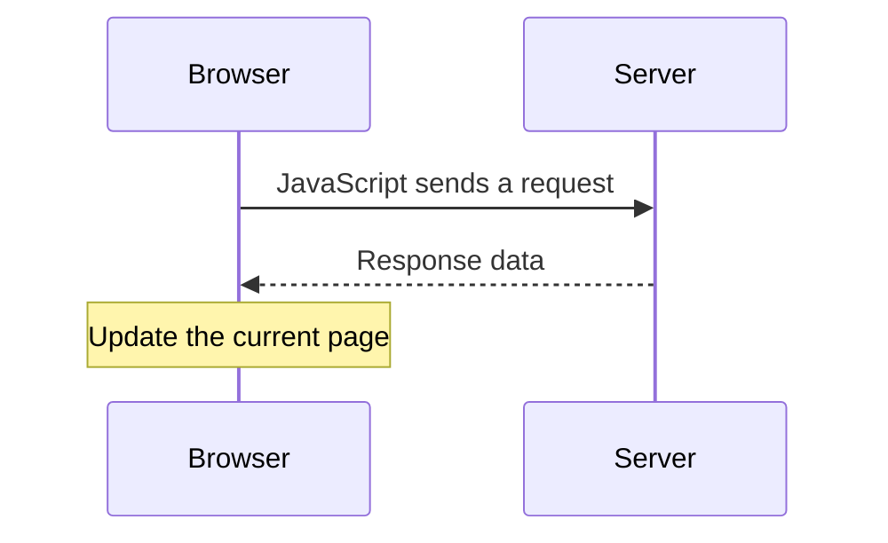

**1999:** XMLHTTP ships with Internet Explorer 5.

**2005:** Jesse James Garrett names the approach “Ajax”.

<!-- speaker-notes -->

Start with the mechanism before naming the application architecture: JavaScript makes an HTTP request and updates part of the current document without navigating. AJAX is Asynchronous JavaScript and XML, but neither XML nor a whole SPA is required. XMLHTTP was the Microsoft precursor to XMLHttpRequest; modern code can use fetch. Hopmann recalls development around late 1998 for Outlook Web Access, followed by shipping in IE5 (18 March 1999). Garrett named the approach on 18 February 2005. Do not claim AJAX predates every SPA by several years: XMLHTTP and early application-style web interfaces developed together, and the AJAX name postdates OWA (2000) and Gmail (2004). Trace the following JSON request/response flow, then show those early applications.

## Slide: AJAX: JSON response · 1/4 Request

```json
{
  "id": "flow-json",
  "type": "material",
  "source": "[22, 23] Teaching model · Adapted from Vepsäläinen",
  "chapter": "Present",
  "next": "flow-json-2",
  "related": ["flow-native-4", "flow-json-4", "rendering-location"]
}
```

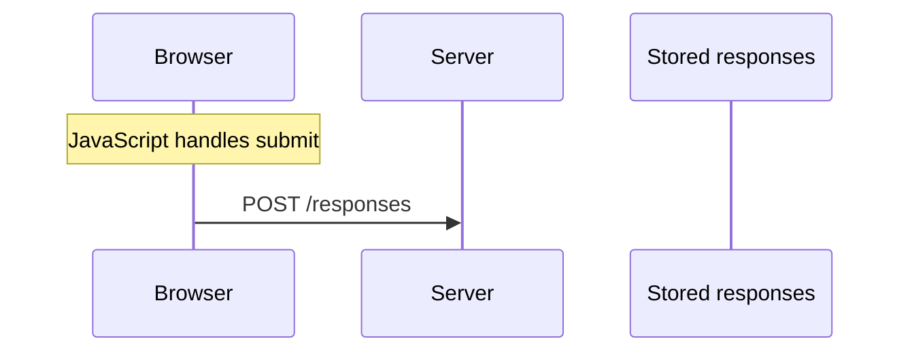

<!-- speaker-notes -->

The server owns authoritative votes; the browser owns this rendering step. A small fetch handler can do this without SPA routing or a framework. Compare this with the earlier native form flow: the server returns data, and JavaScript updates the current page. These diagrams are teaching models, not promises about exact generated routes.
Reveal 1 of 4: Request. Advance with Next; Previous revisits the preceding state.
Full attribution: Explanatory model · [22, 23] Adapted for this lecture from Juho Vepsäläinen’s Web architecture lens

## Slide: AJAX: JSON response · 2/4 Store

```json
{
  "id": "flow-json-2",
  "type": "material",
  "source": "[22, 23] Teaching model · Adapted from Vepsäläinen",
  "chapter": "Present",
  "next": "flow-json-3",
  "related": ["flow-native-4", "flow-json-4", "rendering-location"]
}
```

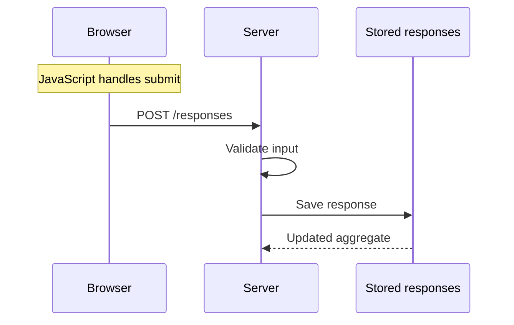

<!-- speaker-notes -->

The server owns authoritative votes; the browser owns this rendering step. A small fetch handler can do this without SPA routing or a framework. Compare this with the earlier native form flow: the server returns data, and JavaScript updates the current page. These diagrams are teaching models, not promises about exact generated routes.
Reveal 2 of 4: Store. Advance with Next; Previous revisits the preceding state.
Full attribution: Explanatory model · [22, 23] Adapted for this lecture from Juho Vepsäläinen’s Web architecture lens

## Slide: AJAX: JSON response · 3/4 Respond

```json
{
  "id": "flow-json-3",
  "type": "material",
  "source": "[22, 23] Teaching model · Adapted from Vepsäläinen",
  "chapter": "Present",
  "next": "flow-json-4",
  "related": ["flow-native-4", "flow-json-4", "rendering-location"]
}
```

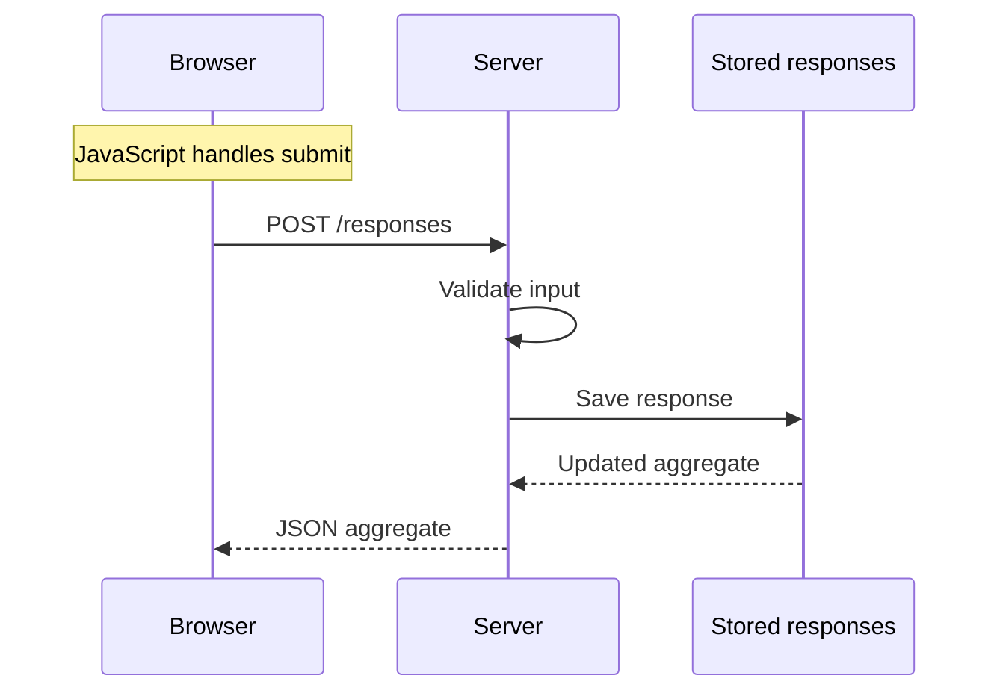

<!-- speaker-notes -->

The server owns authoritative votes; the browser owns this rendering step. A small fetch handler can do this without SPA routing or a framework. Compare this with the earlier native form flow: the server returns data, and JavaScript updates the current page. These diagrams are teaching models, not promises about exact generated routes.
Reveal 3 of 4: Respond. Advance with Next; Previous revisits the preceding state.
Full attribution: Explanatory model · [22, 23] Adapted for this lecture from Juho Vepsäläinen’s Web architecture lens

## Slide: AJAX: JSON response · 4/4 Update

```json
{
  "id": "flow-json-4",
  "type": "material",
  "source": "[22, 23] Teaching model · Adapted from Vepsäläinen",
  "chapter": "Present",
  "next": "early-spas",
  "related": ["flow-native-4", "rendering-location"]
}
```

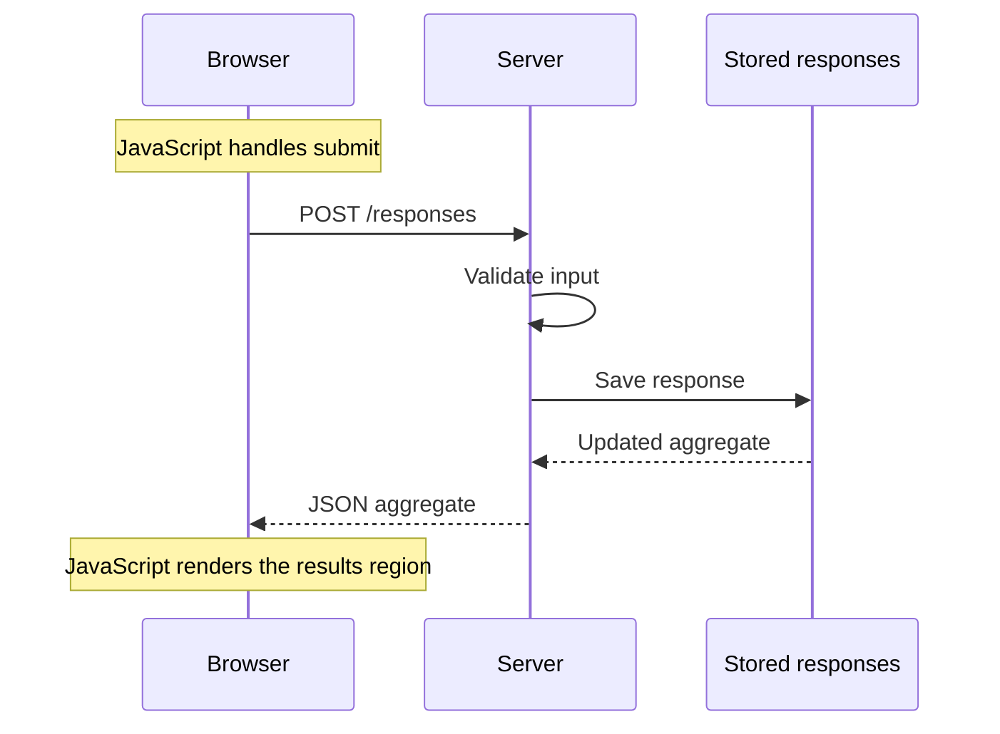

<!-- speaker-notes -->

The server owns authoritative votes; the browser owns this rendering step. A small fetch handler can do this without SPA routing or a framework. Compare this with the earlier native form flow: the server returns data, and JavaScript updates the current page. These diagrams are teaching models, not promises about exact generated routes.
Reveal 4 of 4: Update. Advance with Next; Previous revisits the preceding state.
Full attribution: Explanatory model · [22, 23] Adapted for this lecture from Juho Vepsäläinen’s Web architecture lens

## Slide: Outlook Web Access (2000)

```json
{
  "id": "early-spas",
  "type": "material",
  "source": "[26, 28] Hopmann · Screenshot: ServerWatch, 2002; interface © Microsoft",
  "chapter": "Present",
  "next": "early-spa-gmail",
  "allowRemoteImages": true
}
```


Mail interactions within a browser application, using dynamic HTML and XMLHTTP.

<!-- speaker-notes -->

Build on the AJAX request/response sequences just explained. Introduce SPA as single-page application: the browser updates the current document for application interactions instead of fetching a whole new document for every action. These are documented early examples of the pattern, not a claim that either was the first SPA. Hopmann recalls XMLHTTP development around late 1998 and dates the Exchange 2000 OWA release to 2000; do not label the shipping app 1998. Paul Buchheit dates Gmail’s launch to 1 April 2004 and describes its role in popularizing AJAX. A single AJAX-enhanced form does not by itself make an entire application an SPA. Connect the mail example to preserving an unsent form in our app.

## Slide: Gmail (2004)

```json
{
  "id": "early-spa-gmail",
  "type": "material",
  "source": "[29, 30] Buchheit · Screenshot: Google, original 2004 interface",
  "chapter": "Present",
  "next": "rendering-location",
  "allowRemoteImages": true
}
```


A dynamic mail interface helped popularize AJAX.

<!-- speaker-notes -->

Introduce SPA as single-page application: the browser updates the current document for application interactions instead of fetching a whole new document for every action. These are documented early examples of the pattern, not a claim that either was the first SPA. Hopmann recalls XMLHTTP development around late 1998 and dates the Exchange 2000 OWA release to 2000; do not label the shipping app 1998. Paul Buchheit dates Gmail’s launch to 1 April 2004 and describes its role in popularizing AJAX. A single AJAX-enhanced form does not by itself make an entire application an SPA. Connect the mail example to preserving an unsent form in our app.

## Slide: Initial rendering: server or browser

```json
{
  "id": "rendering-location",
  "type": "material",
  "source": "[23] Lecture adaptation · Web architecture lens",
  "chapter": "Present",
  "next": "rendering-cached",
  "related": ["rendering-cached", "activation-detour"]
}
```

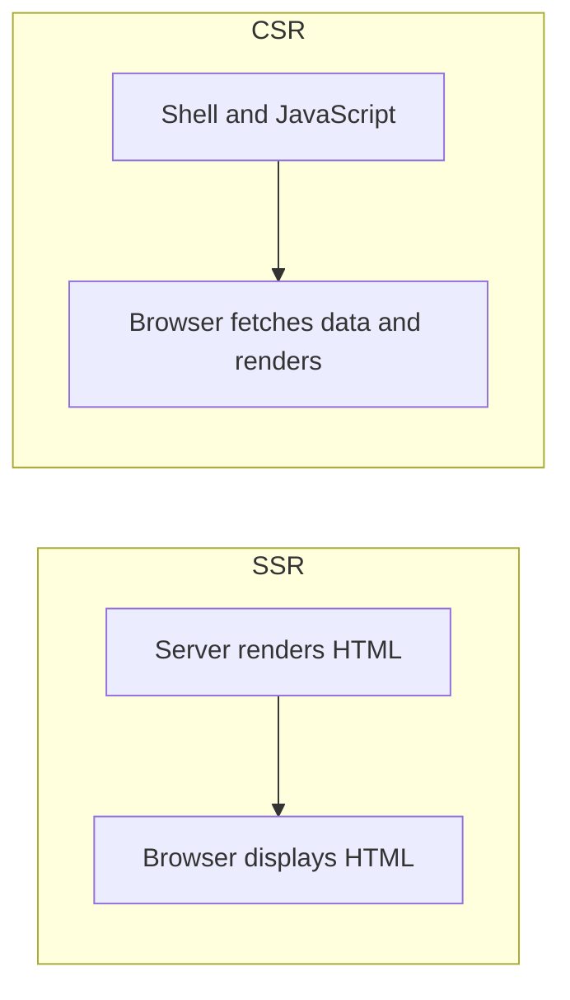

<!-- speaker-notes -->

Now distinguish initial rendering from the subsequent AJAX interactions already traced. SSR means server-side rendering; CSR means client-side rendering. This choice is separate from how later interactions work: SSR can initialize an SPA, and an HTML-first page can use AJAX. Compare the two paths, then explain caching.

## Slide: Serving cached HTML

```json
{
  "id": "rendering-cached",
  "type": "material",
  "source": "[23] Lecture adaptation · Web architecture lens",
  "chapter": "Present",
  "next": "activation-detour",
  "related": ["rendering-location"]
}
```

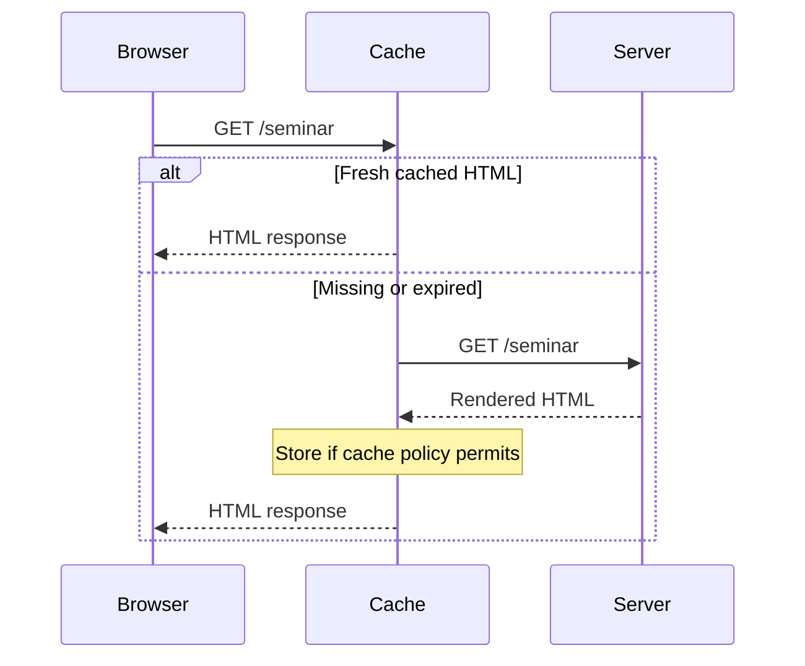

<!-- speaker-notes -->

Follow the same request/response direction as the native form diagram: browser initiates, response returns. This simplified read-only example uses a fresh cached response or waits for the server to produce one. Some systems can instead serve stale content while regenerating, but that is a separate policy. Do not cache a vote POST as a read. The seminar description and a submission confirmation need different freshness guarantees.

## Slide: Visible HTML is not the same as initialized JavaScript

```json
{
  "id": "activation-detour",
  "type": "material",
  "source": "[31] Vepsäläinen · Client activation teaching model",
  "chapter": "Present",
  "next": "browser-frameworks"
}
```

Native links and forms can work before JavaScript initializes.

For a JavaScript-dependent control, the HTML may be visible before the control responds.

In our app, identify which controls still work while scripts load.

<!-- speaker-notes -->

OPTIONAL IF SHORT ON TIME: skip this discussion; keep the next build checkpoint and review. Connect initial rendering to the form already tested. Explain that hydration attaches application behavior to existing HTML. Islands initialize selected regions; resumability aims to resume serialized state without replaying all initialization. Keep the focus on whether the user can complete the task. The linked source is for further exploration; opening another demo is not required.
Full attribution: [31] Juho Vepsäläinen · Client activation lens · Teaching model

## Slide: Organizing browser applications (2012–2016)

```json
{
  "id": "browser-frameworks",
  "type": "material",
  "source": "[32, 33, 34, 35] AngularJS, React, Vue and Angular · Project sources",
  "chapter": "Present",
  "next": "step-11"
}
```

| Tool                 | What it helps organize             |
| -------------------- | ---------------------------------- |
| AngularJS 1.0 · 2012 | Templates and two-way data binding |
| React · 2013         | Component-based user interfaces    |
| Vue · 2014           | Reactive interfaces and components |
| Angular 2 · 2016     | Components, routing and forms      |

The browser manages interface state: unsent input, feedback and displayed results.

<!-- speaker-notes -->

Dates mark AngularJS’s 1.0 release (not the start of the project), React’s open-source release, Vue’s public launch and Angular 2’s release. AngularJS brought templates and two-way data binding into the browser before React. Angular 2 was a rewritten successor, not a minor AngularJS update. React is a UI library; routing and other app concerns use additional tools. Vue and Angular provide different scopes and conventions. These tools address repeated UI/state-management work; they do not define where initial rendering happens, and they are not required for AJAX. Refer back to the server/browser rendering slide. Keep this to about two minutes; no framework migration is required in the running build. Emphasize the shift toward application-like experiences: more interaction state lives in the browser, while the server still owns stored responses.

## Slide: Change a preference; watch the second view

```json
{
  "id": "step-11",
  "type": "material",
  "chapter": "Present",
  "next": "flow-shared",
  "related": ["flow-shared", "flow-json-4", "detour-2-1"],
  "previewOf": "build-application"
}
```

Change a seminar preference. Watch its aggregate update.

<!-- speaker-notes -->

Open two real views. Submit one predefined choice and watch the aggregate. The second view needs its own update mechanism: inspect whether this app polls, uses server-sent events or WebSockets. Do not suggest that updating one browser automatically updates another.

## Slide: Updating a second browser

```json
{
  "id": "flow-shared",
  "type": "material",
  "source": "[22, 23] Teaching model · Adapted from Vepsäläinen",
  "chapter": "Present",
  "next": "check-interactive-app"
}
```

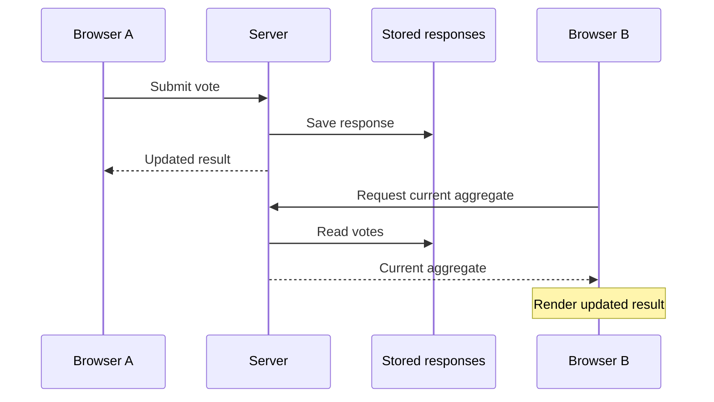

<!-- speaker-notes -->

Polling example only. Server-sent events or WebSockets can deliver updates differently. Match the explanation to the implementation; no need to teach all three transports. Stored state stays on the server, not in either browser’s display.
Full attribution: Explanatory model · [22, 23] Adapted for this lecture from Juho Vepsäläinen’s Web architecture lens

## Slide: Check the build · Two views, one result

```json
{
  "id": "check-interactive-app",
  "type": "material",
  "chapter": "Present",
  "next": "check-interactive-app-review",
  "previewOf": "build-application"
}
```

- Submit in one view; watch the other update.
- Keep an unsent choice while results refresh.
- Submit without leaving the page; watch the confirmation.

<!-- speaker-notes -->

The linked build preview appears automatically on this slide. Advance to return to the lecture. If no preview URL is available, a clearly labeled prepared reference opens. Its behavior is not evidence that the live build succeeded.

Checks to narrate:

- Submit in one view; watch the other update.
- Keep an unsent choice while results refresh.
- Submit without leaving the page; watch the confirmation.

## Slide: Did the interaction become easier?

```json
{
  "id": "check-interactive-app-review",
  "type": "question",
  "chapter": "Present",
  "next": "step-13"
}
```

Start with the test chosen by the priority vote. State **expected → observed → passed or unresolved**.

Then compare the form with the approved needs below. Name one remaining need and the next test.

<!-- speaker-notes -->

Revisit the approved responses after showing the app. Ask the room to distinguish observed behavior from assumptions. Keep one unresolved need for the closing discussion.

## Slide: A person can use this. What would another client need to understand it?

```json
{
  "id": "step-13",
  "type": "question",
  "source": "[36] Petros et al., 2025 · Discussion",
  "chapter": "Present",
  "next": "step-14",
  "related": ["flow-native-4", "flow-json-4", "detour-2-1"]
}
```

**Inspect in pairs**

Pick one action in our app. Identify its required input and how a client can tell it succeeded.

Report one detail that is explicit—and one the client would have to guess.

<!-- speaker-notes -->

Inspect the form or shared contract. Distinguish explicit actions from behavior that must be inferred.
Source keys resolve to the References slides at the end. Unquoted explanations are lecture paraphrases; diagrams are not archival reproductions.
Full attribution: Discussion informed by · [36] Petros, Gross, Shaffer and Revelle (2025)

## Slide: Future

```json
{
  "id": "step-14",
  "type": "title",
  "source": "[37] Lecture hypothesis summary, 2026",
  "chapter": "Future",
  "next": "future-visions",
  "related": ["detour-3-1"]
}
```

Agents and interfaces composed for a task

<!-- speaker-notes -->

Start constrained Future composition when inputs are ready. Explain that the agent building this app and an agent using it are different roles.
Source keys resolve to the References slides at the end. Unquoted explanations are lecture paraphrases; diagrams are not archival reproductions.
Full attribution: Hypothesis · [37] Lecture hypothesis summary (2026); background manuscript unpublished
Before composition, distinguish the two models: the coding agent edits the app’s code; the runtime model proposes a view from bounded data, which the app validates before display. The studio collects lecture input; the app owns its survey data.

## Slide: Where I think we’re headed

```json
{
  "id": "future-visions",
  "type": "material",
  "source": "[37] Lecture hypothesis summary, 2026",
  "chapter": "Future",
  "next": "semantic-web-agents",
  "related": ["vision-bush", "vision-nelson", "vision-engelbart"]
}
```

- People describe a task; software helps carry it out.
- Interfaces can be composed around the task.
- Services need to expose their data and available actions clearly.

<!-- speaker-notes -->

Presenter-led opening: give your perspective on these possible directions, using a concrete example of a task spanning services. Frame this as your outlook, not an inevitable outcome. Connect to the lecture so far: linked documents became browser applications; agents and task-specific interfaces may change how we use those applications. Then introduce the 2001 Semantic Web scenario as an earlier vision of delegation. No audience submission is required here.

## Slide: Semantic Web agents (2001)

```json
{
  "id": "semantic-web-agents",
  "type": "material",
  "source": "[38] Berners-Lee, Hendler & Lassila, 2001 · Teaching diagram",
  "chapter": "Future",
  "next": "vote-priority"
}
```

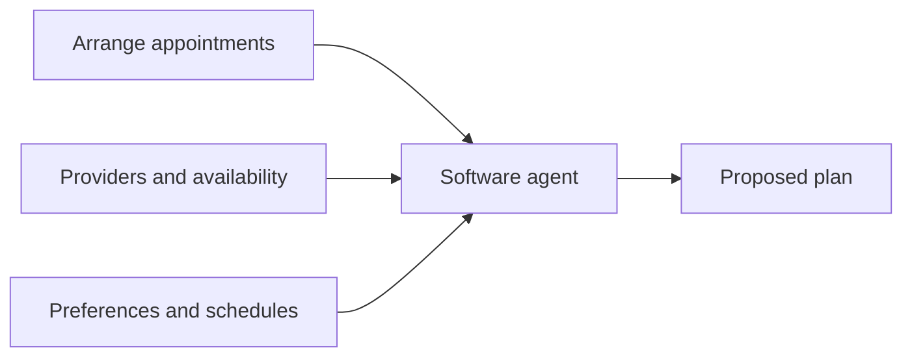

<!-- speaker-notes -->

The article’s fictional scenario coordinates care appointments, provider constraints and family schedules. It illustrates a proposed future, not a deployed system. Explicit data meanings and inference rules were central. Do not equate this with modern language models or claim the Semantic Web disappeared. The practical question remains: how can services communicate meaning well enough for useful delegation?
Full attribution: [38] Berners-Lee, Hendler & Lassila · The Semantic Web (2001) · Paraphrase and original diagram

## Slide: What should the generated seminar view prioritize?

```json
{
  "id": "vote-priority",
  "type": "poll",
  "chapter": "Future",
  "next": "detour-4-0",
  "poll": {
    "question": "What should the generated seminar view prioritize?",
    "options": [
      {
        "id": "overview",
        "label": "Quick overview"
      },
      {
        "id": "learning",
        "label": "Learning outcomes"
      },
      {
        "id": "practical",
        "label": "Practical details"
      }
    ],
    "defaultId": "overview"
  },
  "room": "webdev-2026-priority"
}
```

<!-- speaker-notes -->

This slide opens its prepared poll automatically; closing or leaving freezes the result. Missing decisions require explicitly accepted defaults.

## Slide: Before composition: define the boundary

```json
{
  "id": "detour-4-0",
  "type": "material",
  "source": "Context receipt · Lecture proposal",
  "chapter": "Future",
  "next": "detour-4-1"
}
```

- **Inputs:** reviewed seminar facts, source links, and one frozen aggregate revision; no questions or identifiers.
- **Output:** a view assembled from allowed components and source-backed text.
- **Actions:** existing allowlisted links and controls only; no new booking, purchase, code execution, or authority.
- **Validation:** check the output structure, URLs and claims before rendering.
- **Fallback:** retain the fixed view when the model times out or validation fails.

A **context receipt** records the inputs, destination, revision and result.

<!-- speaker-notes -->

Explain these constraints before showing the Future prompt. Output validation checks shape and allowed actions; checking a claim against a source remains necessary. A context receipt is an audit aid proposed for this lecture, not a security guarantee.

## Slide: From selected inputs to a generated view

```json
{
  "id": "detour-4-1",
  "type": "material",
  "source": "Context receipt · Teaching diagram",
  "chapter": "Future",
  "next": "build-agents"
}
```

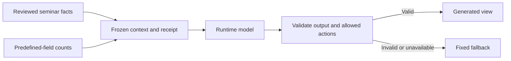

Both views must answer the same task using the same source revision.

<!-- speaker-notes -->

What useful personal information would you refuse to send? This receipt is a proposed design pattern, not a standard.
Source keys resolve to the References slides at the end. Unquoted explanations are lecture paraphrases; diagrams are not archival reproductions.
Full attribution: Original diagram · Lecture context-receipt proposal

## Slide: Build · Compose a constrained interface

```json
{
  "id": "build-agents",
  "type": "build",
  "chapter": "Future",
  "next": "detour-3-1",
  "related": ["detour-3-1"],
  "uses": [
    {
      "poll": "vote-theme",
      "instructions": {
        "editorial": "Use an editorial theme with restrained typography.",
        "retro-web": "Use a readable retro-web theme with accessible contrast.",
        "playful": "Use a playful theme with readable typography and accessible controls."
      }
    },
    {
      "poll": "vote-priority",
      "instructions": {
        "overview": "Prioritize a concise overview using trusted seminar data.",
        "learning": "Prioritize learning outcomes supported by the source.",
        "practical": "Prioritize available dates, location and attendance details; do not invent facts."
      }
    }
  ]
}
```

Advance to Future under our composition contract. Reuse the reviewed material and locked aggregate revision. Show the context receipt and deterministic fallback. Do not widen model authority or deploy unless requested. Include a frozen aggregate of the new seminar-interest responses alongside the lecture priority. Use only predefined-field counts; exclude free-text questions and browser identifiers. State which counts informed the view and show their revision in the context receipt. If no new responses exist, label the fallback rather than inventing preferences. Implement an explicit runtime input/output schema and allowlist components and URLs. Reject malformed or unsupported output before rendering; keep the fixed view available on timeout or rejection. Compare the fixed and composed views using the same task and frozen source revision: find one supported seminar detail, follow its source, and identify the next permitted action. Show both views and their receipt. Do not claim this demonstrates arbitrary autonomous service use.

<!-- speaker-notes -->

Review the frozen seminar-priority vote in the resolved prompt before starting. Start explicitly, then continue discussing while the agent works. Inspect the app using Preview from Codex when ready.
Show the actual resolved build prompt, including the frozen audience priority. Explain that the coding agent builds the application; the runtime composition model has a different, constrained role. No real booking, purchase or personal profile is needed. At the checkpoint, test the same task in the fixed and generated views; a source mismatch or unauthorized control falsifies the claimed improvement.

## Slide: Provider-designed and agent-composed interfaces

```json
{
  "id": "detour-3-1",
  "type": "material",
  "source": "[37] Lecture hypothesis summary, 2026",
  "chapter": "Future",
  "next": "step-15"
}
```

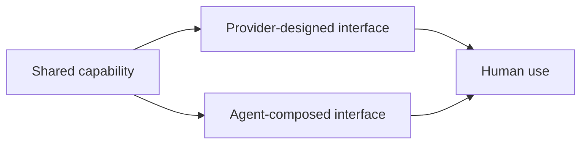

These can coexist. A generated view alone does not show that an agent can safely execute service actions.

<!-- speaker-notes -->

Which application needs a stable interface? These directions can coexist; neither is an established outcome.
Source keys resolve to the References slides at the end. Unquoted explanations are lecture paraphrases; diagrams are not archival reproductions.
Full attribution: Original diagram of a hypothesis · [37] Lecture hypothesis summary (2026); background manuscript unpublished

## Slide: Which application type should we examine?

```json
{
  "id": "step-15",
  "type": "question",
  "source": "[37] Lecture hypothesis summary, 2026",
  "chapter": "Future",
  "next": "application-interface-choice",
  "related": ["detour-3-1"],
  "wordCloud": true
}
```

**Word cloud**

On live.scalableweb.dev, enter **one idea per line**.

Use 1–3 words per idea, up to 32 characters. Submit up to five ideas together.

<!-- speaker-notes -->

Showing this slide live opens a word collection. Ask for an application type, not an interface preference yet. Close collection and approve relevant examples. Select two contrasting types to discuss on the next slide. Keep submissions unprojected until approved.

## Slide: For this application, which interface approach fits?

```json
{
  "id": "application-interface-choice",
  "type": "question",
  "source": "[37] Lecture hypothesis summary, 2026",
  "chapter": "Future",
  "next": "meaning-and-action",
  "reviewWordsFrom": ["step-15"]
}
```

Choose one approved application type below and name a specific user task.

**A · Stable:** the same controls and structure each time.

**B · Generated:** a view composed for the task.

**C · Mixed:** stable core actions with generated supporting views.

Report: **application + task → A, B or C → reason**.

<!-- speaker-notes -->

OPTIONAL IF SHORT ON TIME: skip this discussion; keep the next build checkpoint and review. Take one application type at a time so answers refer to the same case. Ask a pair to name its task and choose A, B or C with a reason; invite another pair to challenge it. Repeat with a contrasting type. Discuss familiarity, error cost, accessibility and variation between tasks. This is a spoken comparison, not an aggregate poll across unrelated applications. These are design hypotheses, not forecasts.

## Slide: Discovering available actions

```json
{
  "id": "meaning-and-action",
  "type": "material",
  "source": "Lecture synthesis · [22, 36, 37, 38]",
  "chapter": "Future",
  "next": "accessibility-parallels"
}
```

| Question             | In our seminar app                     |
| -------------------- | -------------------------------------- |
| What is this?        | Seminar information and its source     |
| What can I do?       | Choose a priority; request a view      |
| What input is valid? | The predefined choices                 |
| What happened?       | A result, rejection or unknown outcome |

<!-- speaker-notes -->

Inspect actual controls and responses. Semantic Web work also considered services and actions; this is not a claim that it only described nouns. The distinction helps explain behavioral affordances. Can the client discover the next action, or must it guess?

## Slide: Human accessibility and agent interaction

```json
{
  "id": "accessibility-parallels",
  "type": "material",
  "source": "[39, 40] WAI guidance · [36, 37] Agent hypothesis",
  "chapter": "Future",
  "next": "accessibility-boundaries",
  "related": ["accessibility-boundaries"]
}
```

| Shared design    | Human accessibility   | Agent use                |
| ---------------- | --------------------- | ------------------------ |
| Named controls   | Identify purpose      | Identify action          |
| Explicit inputs  | Understand choices    | Construct valid input    |
| Exposed state    | Perceive feedback     | Check the outcome        |
| Stable structure | Navigate consistently | Locate relevant controls |

<!-- speaker-notes -->

Human accessibility is the goal in its own right, not a proxy for machine convenience. Assistive technology mediates human use; an autonomous agent is not a screen-reader user. Agent benefit depends on whether it reads the DOM, accessibility tree, pixels or a separate contract. Accessible names are not guaranteed agent success; native HTML still requires testing for keyboard, focus, contrast and understandable feedback. Explicit constraints need server validation. Do not give every static message an ARIA live region.
Full attribution: Human guidance: [39, 40] · Agent parallels: lecture hypothesis [36, 37]

## Slide: Accessible to people does not mean authorized for agents

```json
{
  "id": "accessibility-boundaries",
  "type": "material",
  "source": "Lecture distinction · [36, 37, 39, 40, 41]",
  "chapter": "Future",
  "next": "detour-5-0"
}
```

A clear action can still require permission.

A machine-readable interface can still exclude people.

<!-- speaker-notes -->

After the accessibility parallels, separate usability from authority. Human accessibility includes perception, operation and understanding. Agent access also requires authorization, scope and verification. Compare a well-labeled destructive button with whether an agent should invoke it.

## Slide: Describe an action once

```json
{
  "id": "detour-5-0",
  "type": "material",
  "source": "[37] Lecture hypothesis summary, 2026",
  "chapter": "Future",
  "next": "step-17"
}
```

For **submit seminar interests**, describe:

- **Inputs:** allowed experience, topics and format
- **Preconditions:** valid fields and an authorized submission
- **Outcome:** stored response and explicit confirmation
- **Failure:** preserved input and an honest unknown state

Shared semantics may help different clients. They do not by themselves guarantee accessibility or reliable agent action.

<!-- speaker-notes -->

Ask for a counterexample. Shared semantics do not guarantee accessibility or better agent performance.
Source keys resolve to the References slides at the end. Unquoted explanations are lecture paraphrases; diagrams are not archival reproductions.
Full attribution: Hypothesis · [37] Lecture hypothesis summary (2026); background manuscript unpublished

## Slide: Pick one generated claim; find its source

```json
{
  "id": "step-17",
  "type": "question",
  "source": "Context receipt · Lecture proposal",
  "chapter": "Future",
  "next": "check-composed-interface",
  "related": ["detour-4-0", "detour-4-1"],
  "previewOf": "build-agents"
}
```

**Check the evidence**

Pick one claim in the generated output. Find the input that supports it in the context receipt.

Report the claim and its evidence—or say what evidence is missing.

<!-- speaker-notes -->

Show actual inputs, source data and destination. Separate frozen aggregate priorities from personal information. Inspect the result against its sources. Return to Bush: a personal knowledge tool need not imply surrendering a personal profile. Do not invent a failure if none occurred; use a clearly labeled hypothetical case.
Full attribution: Lecture design proposal · Context receipt is not an established standard If the prepared reference is shown, inspect the fixed fallback and receipt; do not claim a runtime model produced it.

## Slide: Check the build · The generated interface

```json
{
  "id": "check-composed-interface",
  "type": "material",
  "chapter": "Future",
  "next": "check-composed-interface-review",
  "previewOf": "build-agents"
}
```

- Compare the interface with the selected priority.
- Inspect the inputs and locked result it used.
- Show the fallback when generation cannot be used.

<!-- speaker-notes -->

The linked build preview appears automatically on this slide. Advance to return to the lecture. If no preview URL is available, a clearly labeled prepared reference opens. Its behavior is not evidence that the live build succeeded.

Checks to narrate:

- Compare the interface with the selected priority.
- Inspect the inputs and locked result it used.
- Show the fallback when generation cannot be used. If the prepared reference is shown, inspect the fixed fallback and receipt; do not claim a runtime model produced it.

## Slide: Recap · What changes, what remains

```json
{
  "id": "check-composed-interface-review",
  "type": "material",
  "chapter": "Closing",
  "next": "step-18"
}
```

- **Past:** structure information and connect it through links.
- **Present:** improve interaction while preserving a working foundation.
- **Future:** give agents explicit data, permitted actions and verifiable results.

**Across all three: start with people’s needs, then test whether the implementation meets them.**

<!-- speaker-notes -->

Bring the lecture back to its main argument. CERN motivated finding and connecting information; HTML and native forms gave us a usable foundation. Browser enhancements changed the interaction and introduced state and failure cases to handle. Agent-composed views introduced further questions about source evidence, scope and permission. These approaches can coexist: a generated interface still depends on reliable information and actions. Use one observed example from today’s builds to make the final sentence concrete, without claiming an unfinished or failed check succeeded. The next slide recaps what we actually built and tested.

## Slide: What we built and tested

```json
{
  "id": "step-18",
  "type": "material",
  "chapter": "Closing",
  "next": "closing-directions",
  "related": ["detour-5-0"]
}
```

| Stage   | What we added                          | What we checked                                     |
| ------- | -------------------------------------- | --------------------------------------------------- |
| Past    | Seminar information and a native form  | Reading, links and submission without JavaScript    |
| Present | Browser interaction and shared results | In-place updates, unsent choices and shared results |
| Future  | A generated seminar view               | Source inputs, the chosen priority and a fallback   |

<!-- speaker-notes -->

Recap the same seminar app across the three sections. Point to one observed result from each checkpoint. Distinguish completed builds from prepared examples or unfinished work; describe a failed check as a finding, not a success. Recall one difficulty from the opening audience discussion and ask whether our app addressed it. The historical thread connected documents and links, browser interaction, and possible agent use; these approaches can coexist.

## Slide: Where could we take this next?

```json
{
  "id": "closing-directions",
  "type": "material",
  "chapter": "Closing",
  "next": "audience-evidence-recap"
}
```

- **Improve the existing app:** test with seminar visitors and fix where they get stuck.
- **Support another client:** expose actions, inputs and results so it can use the same service.
- **Explore generated views:** compare a generated view with a fixed page on the same task.

<!-- speaker-notes -->

Present these as possible next experiments. For visitor testing, observe whether someone can find a practical detail and submit a preference. For another client, test a permitted action and verify its result. For generated views, compare task completion and factual accuracy against the fixed page using the same source material. Ask what evidence would justify each direction; do not imply that generation is the required next step.

## Slide: What our audience evidence suggests next

```json
{
  "id": "audience-evidence-recap",
  "type": "material",
  "chapter": "Closing",
  "next": "sdlcai-invitation",
  "reviewWordsFrom": ["knowledge-experience"]
}
```

Return to the needs we collected at the start: what did our app address, and what remains?

<!-- speaker-notes -->

Presenter-led recap: briefly connect one approved audience need to an observed build result and acknowledge any unmet need. These findings are not proof that the app implemented every request. Then move directly to Questions without opening another collection.

## Slide: Join us at SDLCAI

```json
{
  "id": "sdlcai-invitation",
  "type": "material",
  "source": "SDLCAI · sdlcai.org · Student link supplied by the lecturer",
  "chapter": "Closing",
  "next": "closing-questions"
}
```


Explore AI across the software lifecycle with researchers and practitioners.

**13 October 2026 · Marsio, Aalto University, Espoo**

Free student tickets (limited): scan the QR or visit **[bit.ly/4wRkjCa](https://bit.ly/4wRkjCa)**

<!-- speaker-notes -->

Invitation immediately before Questions, using the existing ticket-qr.png from the Obsidian assets folder. Short pitch: If today’s questions interested you, join us at SDLCAI to hear how researchers and practitioners are applying AI across software development. Pause for students to scan. The SDLCAI bridge note lists an allotment of 40 free student tickets; the slide says limited availability rather than asserting a live remaining count. The ticket link is supplied by the lecturer, not generated by the demo app. Event details checked against https://www.sdlcai.org/.

## Slide: Questions?

```json
{
  "id": "closing-questions",
  "type": "title",
  "chapter": "Closing",
  "next": "references-title"
}
```

Keep the slides and explore the references:

**[live.scalableweb.dev/slides](https://live.scalableweb.dev/slides)**

<!-- speaker-notes -->

Invite questions from the room. Use the desk’s source inspector or revisit a relevant slide if helpful. Mention that the reading copy includes source links and can be saved as a PDF from its print button.

## Slide: References

```json
{
  "id": "references-title",
  "type": "title",
  "chapter": "References",
  "next": "references-1"
}
```

Sources and further reading

<!-- speaker-notes -->

The main discussion ends on the preceding slide. Continue here when students want the source material.

## Slide: References · 1–5

```json
{
  "id": "references-1",
  "type": "material",
  "chapter": "References",
  "next": "references-2"
}
```

- [1] Mundaneum (n.d.). [History](https://mundaneum.org/en/the-mundaneum/history/)
- [2] Vannevar Bush (1945). [As We May Think](https://www.theatlantic.com/magazine/archive/1945/07/as-we-may-think/303881/)
- [3] Ted Nelson (1965). [A File Structure for the Complex, the Changing and the Indeterminate](https://doi.org/10.1145/800197.806036). ACM national conference. See also [Xanalogical Structure: Now More Than Ever (1999)](https://www.xanadu.net/NOWMORETHANEVER/XuSum99.html).
- [4] Douglas Engelbart (1962). [Augmenting Human Intellect: A Conceptual Framework](https://dougengelbart.org/content/view/138/000/)
- [5] Tim Berners-Lee (1989/1990). [Information Management: A Proposal](https://www.w3.org/History/1989/proposal.html)

<!-- speaker-notes -->

Sources numbered by first appearance in the visible slides; additional reading follows cited sources. Image credits identify source collections, not public-domain status. Lecture diagrams are teaching models; lecture hypotheses are not empirical results.

## Slide: References · 6–10

```json
{
  "id": "references-2",
  "type": "material",
  "chapter": "References",
  "next": "references-3"
}
```

- [6] fdecomite (2011). [Drawers: Mundaneum, Mons](https://commons.wikimedia.org/wiki/File:Drawers.jpg). Photograph, 23 February 2011. [CC BY 2.0](https://creativecommons.org/licenses/by/2.0/); unmodified.
- [7] Computer History Museum. [Memex conceptual sketch](https://www.computerhistory.org/revolution/the-web/20/370/2111), c. 1945; object 500004817.
- [8] Ted Nelson. [Xanalogical Structure](https://xanadu.com.au/ted/XUsurvey/xuDation.html), 2000 version, Fig. 1 (1965 diagram).
- [9] Doug Engelbart Institute. [History in Pictures, §4b](https://dougengelbart.org/content/view/224/217/). Frame from the NLS demonstration, 9 December 1968.
- [10] Tim Berners-Lee and Robert Cailliau (1990). [WorldWideWeb: Proposal for a HyperText Project](https://info.cern.ch/hypertext/WWW/Proposal.html)

<!-- speaker-notes -->

Sources numbered by first appearance in the visible slides; additional reading follows cited sources. Image credits identify source collections, not public-domain status. Lecture diagrams are teaching models; lecture hypotheses are not empirical results.

## Slide: References · 11–15

```json
{
  "id": "references-3",
  "type": "material",
  "chapter": "References",
  "next": "references-4"
}
```

- [11] CERN. [The birth of the Web](https://home.cern/science/computing/the-birth-of-the-web/). Tim Berners-Lee photograph, 1994; CERN PhotoLab, record 39437.
- [12] Tim Berners-Lee. [The WorldWideWeb browser](https://www.w3.org/People/Berners-Lee/WorldWideWeb.html). Browser-editor written in 1990; reproduced screenshot from 1993.
- [13] W3C (2004). [Architecture of the World Wide Web, Volume One](https://www.w3.org/TR/webarch/)
- [14] WHATWG. [HTML text-level semantics](https://html.spec.whatwg.org/multipage/text-level-semantics.html), living standard.
- [15] Håkon Wium Lie and Bert Bos (1996). [Cascading Style Sheets, level 1](https://www.w3.org/TR/REC-CSS1/). W3C Recommendation, 17 December 1996. See also [W3C’s history of CSS](https://www.w3.org/Style/CSS20/history.html) for the 1994 proposal.

<!-- speaker-notes -->

Sources numbered by first appearance in the visible slides; additional reading follows cited sources. Image credits identify source collections, not public-domain status. Lecture diagrams are teaching models; lecture hypotheses are not empirical results.

## Slide: References · 16–20

```json
{
  "id": "references-4",
  "type": "material",
  "chapter": "References",
  "next": "references-flows"
}
```

- [16] Allen Wirfs-Brock and Brendan Eich (2020). [JavaScript: The First 20 Years](https://doi.org/10.1145/3386327). History by key participants; [open author copy](https://zenodo.org/records/4960086).
- [17] Olia Lialina and Dragan Espenschied. [GeoCities: CollegePark/Lounge/9002](https://oneterabyteofkilobyteage.tumblr.com/post/827274459639611392/original-url). Archive capture: 28 April 2009.
- [18] Microsoft (1996). [FrontPage 1.1 release and adoption](https://news.microsoft.com/source/1996/08/06/microsoft-frontpage-1-1-momentum-explodes-in-first-two-months-industry-lauds-web-authoring-and-management-tool-as-best-of-breed/).
- [19] Web Design Museum. [Microsoft FrontPage 1.1 in 1996](https://www.webdesignmuseum.org/software/microsoft-frontpage-1-1-in-1996). Screenshot: View HTML. Software interface © Microsoft.
- [20] Macromedia (1997). [Macromedia Ships Dreamweaver](https://www.mactech.com/1997/12/09/md1-macromedia-ships-dreamweaver/). Launch announcement reproduced by MacTech.

<!-- speaker-notes -->

Sources numbered by first appearance in the visible slides; additional reading follows cited sources. Image credits identify source collections, not public-domain status. Lecture diagrams are teaching models; lecture hypotheses are not empirical results.

## Slide: References · 21–25

```json
{
  "id": "references-flows",
  "type": "material",
  "chapter": "References",
  "next": "references-semantic-access"
}
```

- [21] Web Design Museum. [Macromedia Dreamweaver 1.2 in 1998](https://www.webdesignmuseum.org/software/macromedia-dreamweaver-1-2-in-1998). Screenshot: Working with Document. Software interface © Macromedia.
- [22] WHATWG (living standard). [HTML Living Standard — Forms](https://html.spec.whatwg.org/multipage/forms.html)
- [23] Juho Vepsäläinen. [Web architecture lens](https://scalableweb.dev/demos/#demo-web-architecture-lens). Teaching model: initial delivery and later interaction are separate decisions.
- [24] Steven Champeon and Nick Finck (2003). [Inclusive Web Design for the Future](https://web.archive.org/web/20210226200650/http://www.hesketh.com/publications/inclusive_web_design_for_the_future/). SXSW presentation; archived original.
- [25] Jesse James Garrett (2005). [Ajax: A New Approach to Web Applications](https://www.oceanpark.com/webmuseum/2005/garrett_on_ajax.html)

<!-- speaker-notes -->

Sources numbered by first appearance in the visible slides; additional reading follows cited sources. Image credits identify source collections, not public-domain status. Lecture diagrams are teaching models; lecture hypotheses are not empirical results.

## Slide: References · 26–30

```json
{
  "id": "references-semantic-access",
  "type": "material",
  "chapter": "References",
  "next": "references-history-photos"
}
```

- [26] Alex Hopmann. [The Story of XMLHTTP](https://www.alexhopmann.com/page/the-story-of-xmlhttp). Firsthand account of Outlook Web Access and XMLHTTP.
- [27] Microsoft (1999). [Internet Explorer 5 launch, 18 March 1999](https://news.microsoft.com/source/1999/03/18/microsoft-delivers-worlds-fastest-modern-browser-available-today/). XMLHTTP’s inclusion is described in Hopmann’s firsthand account [26].
- [28] ServerWatch (2002). [Exchange 2000 OWA tutorial, Figure 5](https://www.serverwatch.com/guides/learn-exchange-server-2000-setting-up-outlook-web-access-to-use-ssl-page-2/). Contemporary screenshot; interface © Microsoft.
- [29] Paul Buchheit (2005). [Guess what just turned 34?](https://googleblog.blogspot.com/2005/10/guess-what-just-turned-34.html). Gmail’s launch and dynamic interface.
- [30] Google (2019). [Hitting send on the next 15 years of Gmail](https://blog.google/products-and-platforms/products/gmail/hitting-send-on-the-next-15-years-of-gmail/). Original 2004 inbox screenshot.

<!-- speaker-notes -->

Sources numbered by first appearance in the visible slides; additional reading follows cited sources. Image credits identify source collections, not public-domain status. Lecture diagrams are teaching models; lecture hypotheses are not empirical results.

## Slide: References · 31–34

```json
{
  "id": "references-history-photos",
  "type": "material",
  "chapter": "References",
  "next": "references-spas-frameworks"
}
```

- [31] Juho Vepsäläinen. [Client activation lens](https://scalableweb.dev/demos/#demo-client-activation-lens). Teaching comparison of hydration, islands and resumability.
- [32] React. [React Versions](https://react.dev/versions). Open-source release: 29 May 2013.
- [33] Evan You (2014). [First Week of Launching Vue.js](https://blog.evanyou.me/2014/02/11/first-week-of-launching-an-oss-project/).
- [34] Google Open Source (2016). [Angular, version 2](https://opensource.googleblog.com/2016/09/angular-version-2-proprioception.html).

<!-- speaker-notes -->

Sources numbered by first appearance in the visible slides; additional reading follows cited sources. Image credits identify source collections, not public-domain status. Lecture diagrams are teaching models; lecture hypotheses are not empirical results.

## Slide: References · 35–38

```json
{
  "id": "references-spas-frameworks",
  "type": "material",
  "chapter": "References",
  "next": "references-css-javascript"
}
```

- [35] Miško Hevery (2012). [Better Web Templating with AngularJS 1.0](https://developers.googleblog.com/better-web-templating-with-angularjs-10/). Angular. [What is Angular?](https://angular.dev/docs); AngularJS. [Developer Guide](https://docs.angularjs.org/guide).
- [36] Petros, Gross, Shaffer and Revelle (2025). [The Missing Mechanic: Behavioral Affordances as the Limiting Factor in Generalizing HTML Controls](https://doi.org/10.1145/3720553.3746684)
- [37] [Lecture hypotheses and ways to test them](https://live.scalableweb.dev/hypotheses) (2026). Student-facing summary of the proposals used here; hypotheses, not empirical results. Background: _Hypermedia as a Substrate for the Agentic Web: From Documents to Affordances_, unpublished manuscript supplied by the lecturer.
- [38] Tim Berners-Lee, James Hendler and Ora Lassila (2001). [The Semantic Web](https://lassila.org/publications/2001/SciAm.html). Scientific American 284(5), 34–43.

<!-- speaker-notes -->

Sources numbered by first appearance in the visible slides; additional reading follows cited sources. Image credits identify source collections, not public-domain status. Lecture diagrams are teaching models; lecture hypotheses are not empirical results.

## Slide: References · 39–42

```json
{
  "id": "references-css-javascript",
  "type": "material",
  "chapter": "References"
}
```

- [39] W3C WAI. [Labeling Controls](https://www.w3.org/WAI/tutorials/forms/labels/). Human accessibility guidance.
- [40] W3C WAI. [User Notification](https://www.w3.org/WAI/tutorials/forms/notifications/). Human accessibility guidance.
- [41] W3C WAI (living guidance). [WCAG overview](https://www.w3.org/WAI/standards-guidelines/wcag/)
- [42] Aaron Gustafson (2008). [Understanding Progressive Enhancement](https://alistapart.com/article/understandingprogressiveenhancement/)

<!-- speaker-notes -->

Sources numbered by first appearance in the visible slides; additional reading follows cited sources. Image credits identify source collections, not public-domain status. Lecture diagrams are teaching models; lecture hypotheses are not empirical results.
