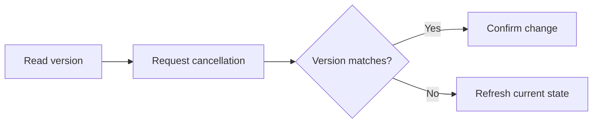

# Portable conference example

## Presentation

```yaml
version: 1
title: Explaining cancellation
pdf:
  aspectRatio: "16:9"
identity:
  presenter: Example presenter
  affiliation: Example research group
  logo: ./logo.svg
```

## Slide: Explain the action and the recovery

```yaml
id: opening
type: title
```

An authored example that travels with the talk.

<!-- speaker-notes -->

PRIVATE_CONFERENCE_NOTE: rehearse the transition.

## Slide: Compare the outcomes

```yaml
id: comparison
reveals:
  rows:
    - step: 1
      table: 1
      rows: [1]
    - step: 2
      table: 1
      rows: [2]
```

| Request         | Server action      | Client action     |
| --------------- | ------------------ | ----------------- |
| Current version | Apply cancellation | Show confirmation |
| Stale version   | Reject the change  | Refresh the order |

::: reveal 1
A valid action changes the order once.
:::

::: reveal 2
A stale request needs recovery, not another cancellation.
:::

## Slide: Follow one order

```yaml
id: order
demo: ./order.html
demoSequence:
  - state: '{"status":"available"}'
    caption: The available action carries the version the client has read.
  - state: '{"status":"cancelled"}'
    caption: Successful cancellation moves the order from version 7 to version 8.
  - state: '{"status":"stale"}'
    caption: A stale version 7 request is rejected; the server keeps version 8 unchanged.
  - state: '{"status":"recovered"}'
    caption: Refresh recovers the current version and confirms that cancellation succeeded.
```

## Slide: Separate the command from recovery

```yaml
id: process
source: Illustrative version-checking model; no production measurements.
```



## Slide: References

```yaml
id: references
chapter: References
```

This example illustrates optimistic concurrency. It does not model payments or delivery.

- [HTTP conditional requests: RFC 9110, section 13](https://www.rfc-editor.org/rfc/rfc9110.html#section-13)
