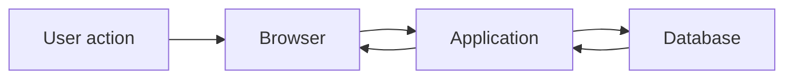

# Design a useful measurement

## Presentation

```yaml
version: 1
title: Design a useful measurement
```

## Slide: Measure the path you care about

```yaml
id: request-path
type: material
chapter: Read
study:
  explanation: |
    An end-to-end measurement and a database measurement answer different questions.
    State where the timer starts, where it stops, and which requests are included.
```



The slowest segment is not necessarily the same under every workload.

## Slide: Write a bounded experiment

```yaml
id: experiment
type: question
chapter: Apply
study:
  prompt: |
    Write down the pressure, workload, environment, measurement boundary, and acceptable result.
    Which observation would cause you to reject your current assumption?
  answer: |
    There is no single correct design. A useful proposal is specific enough to reproduce
    and includes an outcome that would challenge the claim. Keep the raw measurements,
    environment details, and known limitations with the conclusion.
```

Choose one request path in a project you know. Begin with a baseline before proposing a scaling change.
